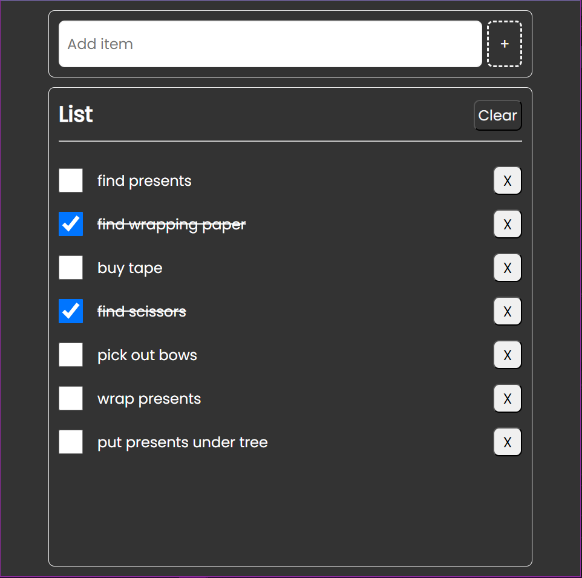

# Todos App using TypeScript

## Description

A simple todos app built using TypeScript to practice my skills for TypeScript. Utilises the use of interfaces and classes.

## Technologies


## Screenshot



## Run Locally

To run the project locally on your machine:

Clone project from Github

```git clone https://github.com/HaylzRandom/todosTS.git```

Install dependencies

```npm i```

Run locally

```npm run dev```